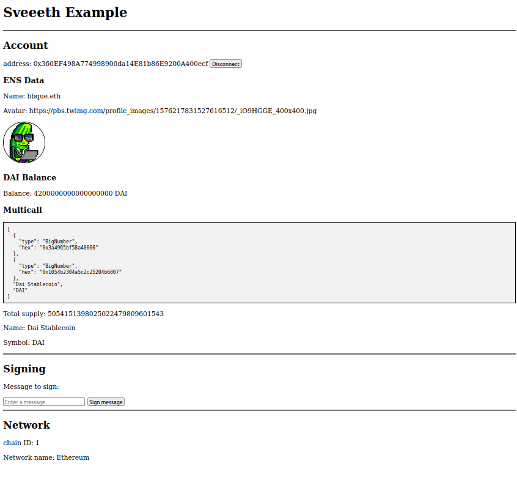

# Example project

A project with various examples of `sveeeth` stores and utilities.

## Running  the project

```bash
# Clone the repo
git clone https://github.com/sveeeth/sveeeth.git

# Enter the example project directory
cd example

# Install dependencies
yarn install

# Start the server
yarn dev
```

### Preview

